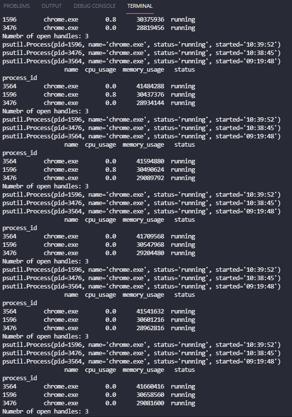

# Problem Definition

the problem is implementation of a program that will launch a specified process and periodically (with a provided time interval) collect the following data about it:
•	CPU usage (percent);
•	Memory consumption: Working Set and Private Bytes (for Windows systems) or Resident Set Size and Virtual Memory Size (for Linux systems);
•	Number of open handles (for Windows systems) or file descriptors (for Linux systems).
Data collection should be performed all the time the process is running. Path to the executable file for the process and time interval between data collection iterations should be provided by user. Collected data should be stored on the disk. Format of stored data should support automated parsing to potentially allow, for example, drawing of charts.

Here, the operating system is Windows.
### requirments
First step is importing the required modules. Here, ```psutil``` is used to running and accessing the processes and their information.

Then, the pass to a process which is planned to launch is specified and it passes to the class which is responsible for this case. 
Class Task_Manager consists of three methods called, ```get_process_info, generate_dataframe, and run```. 

### get_process_info

This method is going to retrieve all processes in a loop. Here, the ```process_iter``` was used to return a process instance for all running processes in the operating system. 
The name of the process was splited from the pas which is specified, and the process which has this name was selected to retrieve it's information, such as status, memory_usage, cpu_usage. All, the processes with this name, will collect into a list called processes. 

### generate_dataframe

This method, was used to convert the processes list to a dataframe, and finally it will be saved in to a csv file. 

### run

The last method, is responsible for running the program. Some arguments are provided such as coulmns for the dataframe and number of process to show, and an argument for sorting.
During the ```while``` loop, the program keep running and continuously printing process informations.

# Visualisation 
Here, I provide the output in my terminal. Also, there is a log file in the following folder ```(/log/log.csv)```.


